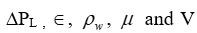
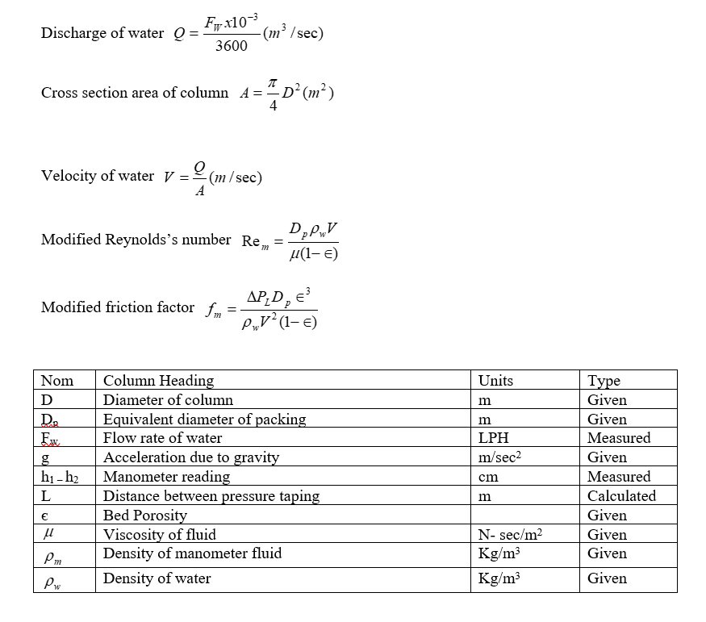

This folder has

## Aim:
To calculate the pressure drop per unit length of bed. To plot modified friction factor vs. modified Reynolds no. on a log-log plot

## Theory:
Packed bed provides a large surface area of contact between two fluids and is thus extensively used in distillation extraction absorption etc. As the fluid passes through the bed. it does so through the voids present in the bed the voids from continuous channels through out the bed .the flow may be laminar through some channels and turbulent in other channels.

Fluids are forced to flow through stationary beds of particulate or porous solids in a wide range of particle situations including moisture assimilation by soils, adsorption, ion exchange, and many of the examples noted in the introductory section.

Modified Reynolds’s number Rem is defined as:

Modified friction factor is defined as:

Where Dp is the equivalent diameter ,  are pressure drop per unit length bed porosity, density of water and velocity of water in bed.

## CALCULATION

 

## EXPERIMENTAL SET UP

The apparatus consists of a column packed with rasching rings. Sump tank with the pump is provided for water circulation. Control valve, by valve and rotameter provided in pipeline for flow control. Three pressure tapings are provided in the packed column. Pressure difference between taping 1 & 2 or 1 & 3 can be measured by manometer after opening corresponding valves. Flow rate can be measured by the rotameter provided.

## PROCEDURE

1.	Close all the valves V1 to V9.
2.	Fill the sump tank 3/4th of its capacity with water.
3.	Fill mercury in the manometer by opening air vent valves V6 - V7 and then close both the valves.
4.	Open by pass valve V2.
5.	Connect electric supply to the set – up.
6.	Switch ON the sump.
7.	Open control valve V1  and set the flow rate to maximum value by observing rotameter.
8.	Close air vent valvs V6 - V7.
9.	Set the flow of water by control valve V1 by pass vale V2 and rotameter.
10.	Note down the flow rate of water.
11.	Record the manometer reading for taping 1 & 3 by opening corresponding pressure taping valves V3 – V4.
12.	Record the manometer reading for taping 1 & 3 by opening corresponding pressure taping valves V3 – V5.
13.	Repeat the experiment for different flow rate of water.

## RESULTS

## PRECAUTIONS

1.	Never run the apparatus if power supply is less than 200 volts and more than 230 volts.
2.	Never close completely the control valveV1 and by pass valve V2 simultaneously.
3.	To prevent clogging of moving parts, run pump at least once in fortnight.
4.	Always keep apparatus free from dust.

